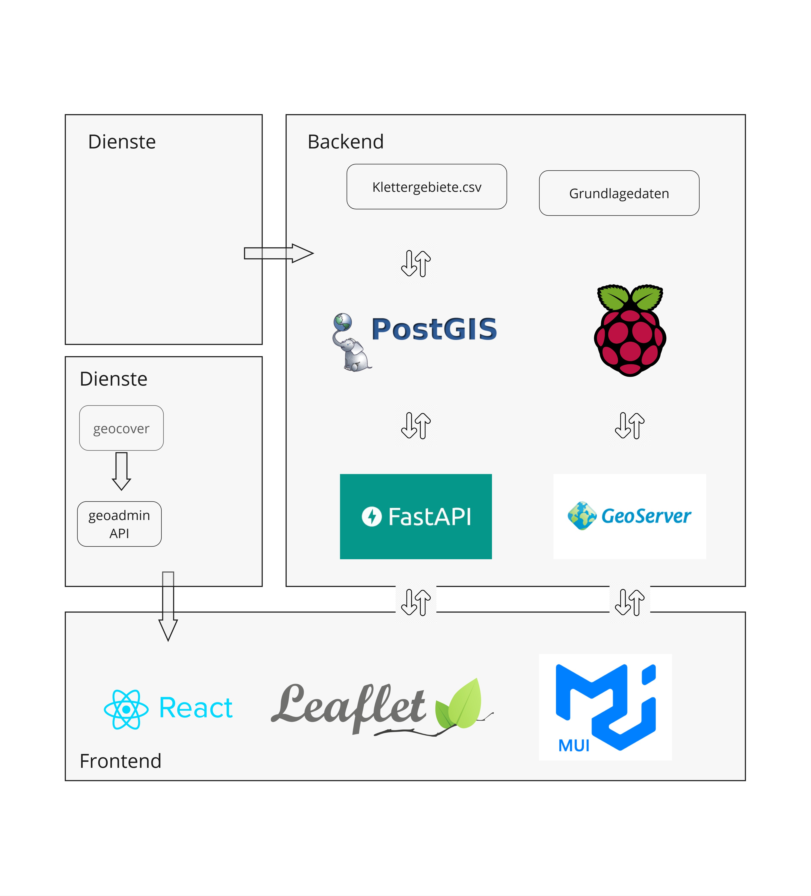

# Aufbau Geodateninfrastruktur (GDI)

Eine vollständige Geodateninfrastruktur (GDI) besteht aus dem Backend, dem Frontend und den verwendeten Bibliotheken und API Schnittstellen. Das folgende Schema zeigt die aufgebaute und verwendete Geodateninfrasturktur der openClimbingMap auf.

## Backend

### Grundlagedaten

#### B - Web-Scraping aktuelle Liga Tabelle

#### D - Web-Scraping Transfer History

### Datenbank

#### Datenbankschema

#### Tabelle land und Abfrage von Länder-Flaggen

#### Import Fussballdaten in die Datenbank

#### Datenbankabfragen (DB-Views)

### Geoserver

Die 4 oben beschriebenen DB-View wurden mittels Geoserver freigegeben.

## Frontend

### React

[React](https://react.dev/) ist eine leistungsstarke JavaScript-Bibliothek zur Erstellung von Benutzeroberflächen, entwickelt von Facebook. Sie ermöglicht es Entwicklern, wiederverwendbare UI-Komponenten zu erstellen, die den Zustand der Anwendung effizient verwalten können. [React](https://react.dev/) wird verwendet, um eine reaktive, benutzerfreundliche Oberfläche zu schaffen, die sich dynamisch an die Interaktionen des Benutzers anpasst. Diese Vorteile von [React](https://react.dev/) wurden ausgenutzt.

Es wird die Bibliothek [Axios](https://axios-http.com/docs/intro) genutzt, um auf Daten von externen Quellen wie dem Geoserver via HTTP-Anfragen zuzugreifen. [Axios](https://axios-http.com/docs/intro) ermöglicht es, asynchrone HTTP-Requests zu senden und zu empfangen,

### Node package manager (npm)

npm erleichtert das Installieren, Aktualisieren und Verwalten von Softwarepaketen, die für die Entwicklung des Frontends, einschliesslich [React](https://react.dev/) und [OpenLayers](https://openlayers.org/), benötigt werden. npm verwaltet Abhängigkeiten für Node.js-Anwendungen.

### Open Layers

[OpenLayers](https://openlayers.org/) wird eingesetzt, um die geografischen Daten in einer interaktiven Karte darzustellen, die Benutzerinteraktionen wie Zoomen, Verschieben und Klicken auf Elemente unterstützt. [OpenLayers](https://openlayers.org/) kann über seine umfangreichen Quellenoptionen direkt auf den Geoserver zugreifen, um räumliche Daten zu laden und anzuzeigen. Durch die Verwendung von WMS (Web Map Service) oder WFS (Web Feature Service), ermöglicht [OpenLayers](https://openlayers.org/) das Abrufen der bereitgestellten Geodaten auf dem Geoserver. Explizit wurden aus der Datenbank mehrere Views erstellt, welche auf dem Geoserver abgelegt sind. Genau auf diese Views wird via [Axios](https://axios-http.com/docs/intro) auf die Daten zugegriffen, die über diese Views zur Verfügung gestellt werden. Für die Seite Transfer History werden beispielsweise die jeweiligen Transferlinien des gewählten Spielers über den View auf dem Geoserver abgefragt und mittels Open Layers dargestellt. Mit den Methoden getSource und getFeatures werden die einzelnen Linien identifiziert.

### UI Design

Das [User Interface (UI)](https://www.unic.com/de/magazin/was-ist-user-experience-ux-was-user-interface-ui) Design konzentriert sich darauf, wie die Website optisch gestaltet ist und wie die Benutzerelemente angeordnet sind. Für die Footballmap wurde ein minimales Design gewählt, das durch die Verwendung von dynamischen Karten und interaktiven Geodaten ergänzt wird. Die visuelle Darstellung auf der Startseite und in den verschiedenen Funktionsbereichen wie "Squad Overview" und "Transfer History" verwendet eine Kombination aus Icons, Menüleisten und interaktiven Karten, die intuitiv und leicht zugänglich sind. Farben und Schriftarten sind so gewählt, dass sie Lesbarkeit verbessern und die Hierarchie der Funktionen erkennbar ist. Das minimale Design erleichtert das Lesen von Information und regt an die verschiedenen Ligen, Vereine, Spieler und deren Transferhistorie zu erkunden. Die Menubar inklusive Dropdowns wurde mit [MUI-Material](https://mui.com/) erstellt. Alle restlichen Komponenten wurden manuell in [HTML](https://de.wikipedia.org/wiki/Hypertext_Markup_Language) erstell und mit [CSS](https://de.wikipedia.org/wiki/Cascading_Style_Sheets) gestylt.

### UX Design

Das [User Experience (UX)](https://www.unic.com/de/magazin/was-ist-user-experience-ux-was-user-interface-ui) Design der Footballmap zielt darauf ab, eine nahtlose Nutzererfahrung zu schaffen. Dies wird durch die geplante Benutzerführung versucht, die es den Nutzenden ermöglicht, schnell und effizient durch die verschiedenen Funktionen der Plattform zu navigieren. Die interaktiven Elemente, wie das Klicken auf Clublogos, um die weiteren Funktionen zu einem Club oder Spieler zu erhalten, sind möglichst logisch gestaltet. Der Übergang zwischen den einzelnen Seiten und Funktionen ist über einen Klick möglich, wodurch die Nutzer engagiert bleiben und leicht verstehen können, wie sie die benötigten Informationen abrufen können. Die Hauptfunktionen mit der meisten Benutzung sind die Dropdown-Elemente im Headerbereich. Alle Buttons wurden im gleichen Stil verwaltet. Das Highliten der Buttons und der Tabelleneinträge bei einem Mouse-Hover und die Änderung der Cursordarstellung vermittelt den Nutzenden, dass eine Funktion an dieser Stelle aufgerufen wird. Ausserdem verstärkt das Farbdesign mit einer dunkeln Grundfarbe (dunkelblau) und zwei kontrastreichen Ergänzugsfarben (weiss/gelb) die einzelnen Hervorhebungen und Buttons. Die Dropdown-Elemente werden mit einer Überschrift beschrieben. Die Überschriften verdeutlichen den Nutzenden, was mit diesem Dropdown ausgewählt werden kann. Alle User-Interaktionen sind durch Hover-Styling und Cursor-Styling klar verständlich. Alle beschriebenen Funktionen und Interaktionen wurden bei einem Nutzertest mit einem Umfang von 8 Personen getestet. Die Nutzenden wurden beobachtet und die Fehlinteraktionen wurden notiert. Einige nicht implementierte Funktionen wurden von den Testpersonen erwartet, die im Kapitel [Erweiterungsmöglichkeiten](ausblick.md#erweiterungsmöglickeiten) beschrieben werden. Die möglichen Fehlinteraktionen wurden so weit wie möglich minimiert.

[↑](#top)

  

    <a href="funktionen.html">← Erklärung der Funktionen</a>
  

  

    <a href="konzept.html">Konzept und Ideen →</a>
  

