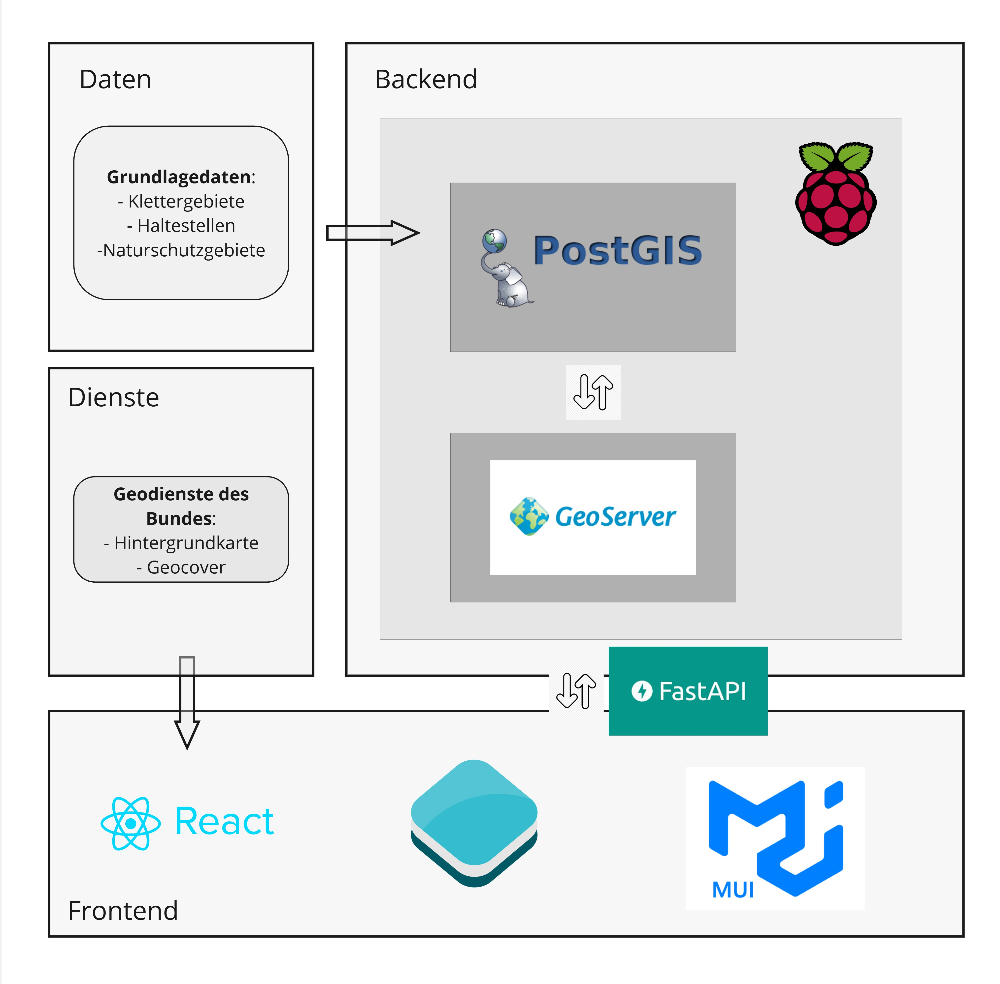

# Aufbau Geodateninfrastruktur (GDI)

Eine vollständige Geodateninfrastruktur (GDI) besteht aus dem Backend, dem Frontend und den verwendeten Bibliotheken und API Schnittstellen. Diese Webanwendung basiert auf einer klar strukturierten, modernen Architektur, die vollständig auf Open-Source-Komponenten aufbaut. Das folgende Schema zeigt die aufgebaute und verwendete Geodateninfrasturktur der openClimbingMap auf.

## Backend

Im Backend laufen alle zentralen Prozesse der Datenverarbeitung und -bereitstellung zusammen. Es übernimmt die Speicherung, Verwaltung und den Zugriff auf die räumlichen Informationen. Die Architektur ist modular aufgebaut, sodass einzelne Komponenten unabhängig weiterentwickelt oder ausgetauscht werden können. Trotz seiner Leistungsfähigkeit kann das gesamte Backend auf einem energiesparenden Raspberry Pi betrieben werden, was die Lösung besonders nachhaltig und kosteneffizient macht.

### PostGIS

Die Geodaten – darunter Datensätze zu Klettergebieten, Haltestellen und Naturschutzgebieten – werden in einer PostGIS-Datenbank gespeichert. PostGIS erweitert das relationale Datenbanksystem PostgreSQL um umfangreiche Funktionen zur Verarbeitung räumlicher Daten. Damit können geografische Objekte effizient gespeichert, abgefragt und analysiert werden. Diese robuste Datenbasis bildet das Fundament der Anwendung und sorgt für hohe Flexibilität und Erweiterbarkeit, insbesondere wenn zukünftig zusätzliche Datenquellen integriert werden sollen.

### GeoServer

Zur Veröffentlichung der Geodaten kommt GeoServer zum Einsatz. Dieser Server stellt die Daten über standardisierte Schnittstellen wie WMS (Web Map Service) und WFS (Web Feature Service) bereit. Dadurch können die Inhalte nicht nur innerhalb der Webanwendung, sondern auch in anderen GIS-Systemen oder Webdiensten genutzt werden. GeoServer ermöglicht zudem die individuelle Gestaltung der Kartendarstellung und die gezielte Steuerung des Datenzugriffs, was ihn zu einem zentralen Werkzeug in der Datenbereitstellung macht.

## Frontend

Das Frontend der Anwendung setzt auf moderne Webtechnologien, die eine reaktive, performante und benutzerfreundliche Oberfläche ermöglichen. Es ist modular aufgebaut und kann flexibel erweitert oder an individuelle Anforderungen angepasst werden. Für die Entwicklung wird [React](https://react.dev/) eingesetzt, eine leistungsstarke JavaScript-Bibliothek zur Erstellung dynamischer Webanwendungen. Ergänzt wird das Setup durch den Node Package Manager [(npm)](https://www.npmjs.com/), der für das effiziente Verwalten und Aktualisieren aller benötigten Pakete und Abhängigkeiten zuständig ist. Für die Darstellung und Interaktion mit Geodaten kommt [OpenLayers](https://openlayers.org/) zum Einsatz. Diese Bibliothek bindet die Kartendaten ein und bietet umfangreiche Funktionen für eine interaktive Kartennavigation direkt im Browser.

### React

[React](https://react.dev/) ist eine weit verbreitete JavaScript-Bibliothek, entwickelt von Facebook, zur Erstellung wiederverwendbarer UI-Komponenten. Sie ermöglicht es, Benutzeroberflächen modular aufzubauen und dynamisch auf Nutzerinteraktionen zu reagieren. Die komponentenbasierte Struktur erleichtert nicht nur die Wartung und Erweiterung des Codes, sondern sorgt auch für eine performante Darstellung, da nur betroffene Teile der Oberfläche bei Änderungen neu gerendert werden. In dieser Anwendung wird [React](https://react.dev/) eingesetzt, um eine moderne, benutzerfreundliche und reaktive Oberfläche bereitzustellen.

Als Brücke zwischen Frontend und Backend fungiert [FastAPI](https://fastapi.tiangolo.com/). Diese moderne Web-API auf Python-Basis ist für ihre hohe Performance und einfache Struktur bekannt. Sie ermöglicht schnellen und zuverlässigen Zugriff auf Daten und Dienste im Backend – etwa für Suchanfragen, Filterfunktionen oder Benutzerinteraktionen. Durch die klare Schnittstellendefinition ist [FastAPI](https://fastapi.tiangolo.com/) besonders wartungsfreundlich und lässt sich leicht in bestehende Systeme integrieren.

### Node package manager (npm)

[npm](https://www.npmjs.com/) ist ein zentrales Werkzeug zur Verwaltung von Abhängigkeiten und Modulen im Projekt. Es erleichtert das Installieren, Aktualisieren und Verwalten von Softwarepaketen, die für die Entwicklung des Frontends – einschließlich [React](https://react.dev/) und [OpenLayers](https://openlayers.org/) – benötigt werden. Durch npm lassen sich externe Bibliotheken effizient integrieren und aktuell halten, was die Entwicklungsgeschwindigkeit erhöht und die langfristige Wartbarkeit verbessert. Darüber hinaus ermöglicht es eine einfache Strukturierung und Reproduzierbarkeit der Entwicklungsumgebung.

### Material UI (MUI)

Für das visuelle Erscheinungsbild sorgt Material UI [(MUI)](https://mui.com/), ein modernes UI-Framework, das auf den Designprinzipien von Google Material Design basiert. MUI bietet eine breite Palette an vorgefertigten Komponenten wie Buttons, Dialoge oder Tabellen, die sich optisch konsistent und responsiv in die Anwendung integrieren lassen. Dies erleichtert nicht nur die Gestaltung, sondern sorgt auch für eine positive Nutzererfahrung auf verschiedenen Endgeräten.

### Open Layers

[OpenLayers](https://openlayers.org/) wird eingesetzt, um die geografischen Daten in einer interaktiven Karte darzustellen, die Benutzerinteraktionen wie Zoomen, Verschieben und Klicken auf Elemente unterstützt. [OpenLayers](https://openlayers.org/) kann über seine umfangreichen Quellenoptionen direkt auf den Geoserver zugreifen, um räumliche Daten zu laden und anzuzeigen. Durch die Verwendung von WMS (Web Map Service) oder WFS (Web Feature Service), ermöglicht [OpenLayers](https://openlayers.org/) das Abrufen der bereitgestellten Geodaten auf dem Geoserver. Explizit wurden aus der Datenbank mehrere Views erstellt, welche auf dem Geoserver abgelegt sind.

### Geodienste des Bundes
Ergänzend zu den eigenen Datenquellen bindet die Webanwendung auch offizielle Geodienste des Bundes direkt in die Kartenanwendung ein, also der WMS-Dienst der swisstopo. Dazu zählen unter anderem Hintergrundkarten und der sogenannte Geocover-Dienst. Diese Dienste liefern qualitativ hochwertige, stets aktuelle Kartengrundlagen, die das eigene Datenangebot sinnvoll ergänzen. Die Einbindung erfolgt direkt im Frontend, sodass keine zusätzliche Serverlast entsteht und die Nutzer dennoch auf zuverlässige, amtliche Kartendaten zugreifen können. Damit wird eine professionelle und vertrauenswürdige Kartendarstellung sichergestellt, ohne dass eigene Ressourcen für die Bereitstellung dieser Inhalte benötigt werden.

[↑](#top)

  

    <a href="funktionen.html">← Erklärung der Funktionen</a>
  

  

    <a href="konzept.html">Konzept und Ideen →</a>
  

