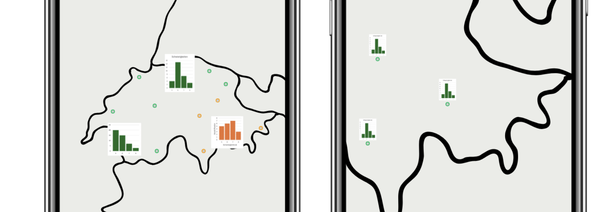

# Erweiterungsmöglichkeiten

Im folgenden Abschnitt werden für Verbesserungs- und Erweiterungsvorschläge beschrieben, mit welchen die App verbessert werden könnte. Diese können Vorteile für die User Experience bringen, oder die openClimbingMap um Features erweitern.

### Allgemein

- Die App könnte in zwei Nutzungspfade aufgeteilt werden. Die dargestellten Elemente werden auf den jeweiligen Nutzungspfad optimiert. Statt Kompromisse einzugehen, weil alle Funktionen auf einer Seite dargestellt werden, kann eine optimale Darstellung erreicht werden. Die Nutzungspfade sind einerseits «Klettergebiete erkunden» und «Klettergebiet erfassen». Der jeweilige Nutzungspfad könnte zu Beginn einer Session gewählt werden.

- **_Frontend:_**
- **_Umsetzung Backend:_**
- **_Backend:_**

### Datenvisualisierung

- Die Daten der Klettergebiete könnten informationsbringender dargestellt werden, als durch Punkte. Eine Möglichkeit ist, die Anzahl und Schwierigkeiten der Routen als Balkendiagramme darzustellen. Diese passen sich dynamisch an die Zoomstufe an. So kann schneller ein passendes Klettergebiet gefunden werden, ohne sich durch alle Punkte durchzuklicken. Ein Beispiel ist in folgendem Mockup dargestellt.

- Es könnte eine Liste implementiert werden, durch die der User sich durch die Klettergebiete wischen kann. Diese Liste ist dynamisch mit der Karte verknüpft und kann durch die Filterkriterien eingeschräntk werden.

- Es könnten Bilder in die Datenbank gespeichert werden, um die Routen und Sektoren der Klettergebiete darzustellen.

- Es könnten 3D-Darstellungen der Kletterrouten innerhalb eines 3D-Viewers implementiert werden. Mit den AR-Möglichkeiten eines Smartphones könnten diese mit der Realität in Übereinstimmung gebracht werden. So könnten vor Ort die Routen durch die Smartphonekamera in 3D-Dargestellt werden. Dieses Feature ist komplex und müsste gnügend robust implementiert werden, damit es genutzt wird.

### Parkplätze, ÖV und Routing

- Um den Zugang zu einem Klettergebiet aufzuzeigen, könnte ein Routing implementiert werden. Die zwei gängisten Möglichkeiten zu einem Klettergebiet zu gelangen sind mit dem Auto, dem ÖV und zu Fuss. Meist ist eine Kombination von zwei Möglichkeiten das Mittel der Wahl. Dieses Routing könnte beispielsweise vom aktuellen Standort oder von einer Adresse nach Wahl erfolgen.

[↑](#top)

  

    <a href="funktionen.html">← Konzept und Ideen</a>
  

  

   <a href="quellenverzeichnis.html">Quellenverzeichnis →</a>
  

