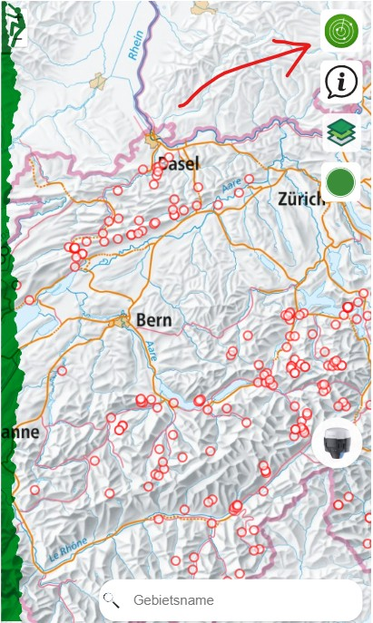

# Erklärung der Funktionen von openClimbingMap

In diesem Abschnitt werden die Funktionen und Interaktionen der openClimbingMap beschrieben.

## Startpage

Auf der Startseite erscheint eine dynamische Karte, die auf die Schweiz fokussiert ist.

---

### Funktionen:

#### 1. **Filterung von Klettergebieten**
- Die Darstellung der Klettergebiete auf der Basemap wird auf jene Gebiete beschränkt, die den eingegebenen Suchparametern entsprechen. (Dieser Abschnitt wird genauer erläutert, sobald die Funktion implementiert ist.)

  

---

#### 2. **Info-Button**
- Unter diesem Button werden wichtige Informationen zur App in einem eigenen Fenster angezeigt:
  - Nutzung der Anwendung
  - Verfügbare Funktionen
  - Allgemeine Informationen zum Klettersport, einschließlich einer Legende zu den Schwierigkeitsgraden der Routen in den Klettergebieten.

---

#### 3. **Layer-Button**
- Ermöglicht das Wechseln zwischen drei verschiedenen Hintergrundkarten:
  1. Swisstopo farbig
  2. Luftbild
  3. Geocover (Gesteinskarte)

- Zusätzliche Layer, die über eine Checkbox ein- und ausgeschaltet werden können:
  - Naturschutzgebiete (WFS-Dienst vom GeoServer)
  - ÖV-Haltestellen (WFS-Dienst vom GeoServer)

---

#### 4. **Klettergebiet erfassen**
- Beim Klick auf den entsprechenden Button öffnet sich ein Eingabefenster zur Erfassung der Attribute eines neuen Klettergebiets.

- Validierung:
  - Doppelte Namen werden verhindert.
  - Negative Routenanzahlen sind nicht erlaubt.
  - Warnung, falls sich das Gebiet innerhalb eines Naturschutzgebiets befindet.

- Eingabemöglichkeiten:
  1. Disziplin und Schwierigkeitsgrad: Auswahl über Dropdown-Menüs.
  2. Koordinaten:
     - Manuell als LV95-Koordinaten.
     - Automatisch via GPS-Position (umgerechnet in LV95 / EPSG:2056).
     - Durch Klick auf einen Punkt auf der Karte.
  3. Höhe: Automatisiert über eine API von Swisstopo bezogen.

- Buttons im Eingabefenster:
  - *Hinzufügen*: Überträgt die eingegebenen Daten via FastAPI-Schnittstelle in die PostgreSQL/PostGIS-Datenbank und zeigt das neue Klettergebiet auf der Karte.
  - *Reset*: Setzt alle Eingabefelder auf ihren Ursprungszustand zurück.
  - *Abbrechen*: Schließt das Eingabefenster ohne zu speichern.

---

#### 5. **Navigation zur eigenen Position**
- Beim Klick auf den Emlid-Button wird zur aktuellen Position des Nutzers auf der Karte gezoomt.

---

#### 6. **Suchfunktion**
- Beim Eintippen eines Begriffs ins Suchfeld wird die GeoJSON-Datenliste (vom GeoServer) gefiltert.
- Funktionalität:
  - Nur Klettergebiete, deren Name mit dem eingegebenen Begriff beginnt, bleiben sichtbar.
  - Ergebnisse erscheinen in einer Liste.
  - Bei Klick auf ein Ergebnis wird auf das entsprechende Gebiet gezoomt.

---

[↑ Zurück nach oben](#top)

  

    <a href="einleitung.html">← Einleitung</a>
  

  

    <a href="aufbauGDI.html">Aufbau GDI →</a>
  

