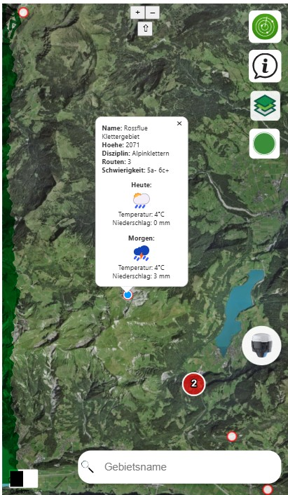

# Erklärung der Funktionen von openClimbingMap

In diesem Abschnitt werden die Funktionen und Interaktionen der openClimbingMap beschrieben.

## Startpage

Das Frontend besteht aus einer One-Page-Applikation im Smartphone-Layout, die mehrere Funktionen bietet, wie die Auswahl der Hintergrundkarte, das Zoomen auf den aktuellen Standort, die Erfassung neuer Gebiete und die Filterung der Klettergebiete. Die Klettergebiete werden als Punkte dargestellt. Beim Klicken auf ein Klettergebiet öffnet sich ein Pop-up-Fenster mit Detailinformationen (Name, Höhe, Disziplin, Anzahl der Routen, Schwierigkeit). Zusätzlich werden die Wetterdaten am Standort des Klettergebiets angezeigt. Die Klettergebiete und deren Attribute werden über einen WFS-Dienst vom GeoServer bereitgestellt, während die Wetterdaten über die API der meteoblue AG abgerufen werden.

  

---

### Funktionen:

#### 1. **Filterung von Klettergebieten**
- Die Darstellung der Klettergebiete auf der Basemap wird auf jene Gebiete beschränkt, die den eingegebenen Suchparametern entsprechen.Diese Filterparameter umfassen die Disziplin (Sportklettern oder Alpinklettern), die über Checkboxen ein- oder abgewählt werden können. Mit einem Doppelslider lassen sich die Minimal- und Maximalwerte für die Höhe über Meer, die Anzahl Routen und die Schwierigkeitsstufe einstellen. Diese Suchfunktionen werden anschliessend als Einschränkungen genutzt, um die gewünschten Klettergebiete darzustellen.

  <video width="400" controls>
    <source src="videos/filter.mp4" type="video/mp4">
    Dein Browser unterstützt das Video-Tag nicht.
  </video>

---

#### 2. **Info-Button**
- Unter diesem Button werden wichtige Informationen zur App in einem eigenen Fenster angezeigt:
  - Nutzung der Anwendung
  - Verfügbare Funktionen
  - Allgemeine Informationen zum Klettersport, einschließlich einer Legende zu den Schwierigkeitsgraden der Routen in den Klettergebieten.

  <video width="400" controls>
    <source src="videos/Info.mp4" type="video/mp4">
    Dein Browser unterstützt das Video-Tag nicht.
  </video>

---

#### 3. **Layer-Button**
- Ermöglicht das Wechseln zwischen drei verschiedenen Hintergrundkarten:
  1. Swisstopo farbig
  2. Luftbild
  3. Geocover (Gesteinskarte)

- Zusätzliche Layer, die über eine Checkbox ein- und ausgeschaltet werden können:
  - Naturschutzgebiete (WFS-Dienst vom GeoServer)
  - ÖV-Haltestellen (WFS-Dienst vom GeoServer)

  <video width="400" controls>
    <source src="videos/Hintergrund.mp4" type="video/mp4">
    Dein Browser unterstützt das Video-Tag nicht.
  </video>

---

#### 4. **Klettergebiet erfassen**
- Beim Klick auf den entsprechenden Button öffnet sich ein Eingabefenster zur Erfassung der Attribute eines neuen Klettergebiets.

- Validierung:
  - Doppelte Namen werden verhindert.
  - Negative Routenanzahlen sind nicht erlaubt.
  - Warnung, falls sich das Gebiet innerhalb eines Naturschutzgebiets befindet.

- Eingabemöglichkeiten:
  1. Disziplin und Schwierigkeitsgrad: Auswahl über Dropdown-Menüs.
  2. Koordinaten:
     - Manuell als LV95-Koordinaten.
     - Automatisch via GPS-Position (umgerechnet in LV95 / EPSG:2056).
     - Durch Klick auf einen Punkt auf der Karte.
  3. Höhe: Automatisiert über eine API von Swisstopo bezogen.

- Buttons im Eingabefenster:
  - *Hinzufügen*: Überträgt die eingegebenen Daten via FastAPI-Schnittstelle in die PostgreSQL/PostGIS-Datenbank und zeigt das neue Klettergebiet auf der Karte.
  - *Reset*: Setzt alle Eingabefelder auf ihren Ursprungszustand zurück.
  - *Abbrechen*: Schließt das Eingabefenster ohne zu speichern.

  <video width="400" controls>
    <source src="videos/Erfassen.mp4" type="video/mp4">
    Dein Browser unterstützt das Video-Tag nicht.
  </video>

---

#### 5. **Navigation zur eigenen Position**
- Beim Klick auf den Emlid-Button wird zur aktuellen Position des Nutzers auf der Karte gezoomt.

  <video width="400" controls>
    <source src="videos/Emlid.mp4" type="video/mp4">
    Dein Browser unterstützt das Video-Tag nicht.
  </video>

---

#### 6. **Suchfunktion**
- Beim Eintippen eines Begriffs ins Suchfeld wird die GeoJSON-Datenliste (vom GeoServer) gefiltert.
- Funktionalität:
  - Nur Klettergebiete, deren Name mit dem eingegebenen Begriff beginnt, bleiben sichtbar.
  - Ergebnisse erscheinen in einer Liste.
  - Bei Klick auf ein Ergebnis wird auf das entsprechende Gebiet gezoomt.

  <video width="400" controls>
    <source src="videos/Suchen.mp4" type="video/mp4">
    Dein Browser unterstützt das Video-Tag nicht.
  </video>

---

[↑ Zurück nach oben](#top)

  

    <a href="einleitung.html">← Einleitung</a>
  

  

    <a href="aufbauGDI.html">Aufbau GDI →</a>
  

