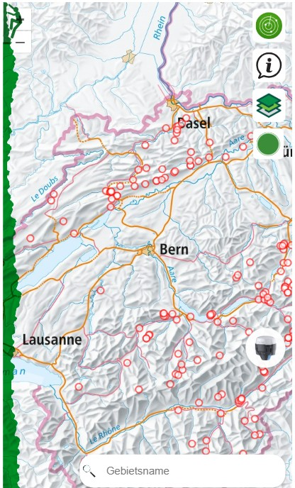

# GDI-Projekt - openClimbingMap

Willkommen auf der GitHub-Page der Geodateninfarastruktur openClimbingMap. Hier findest du alles über die vorhandenen Funktionen und die Informationen über die Entwicklung der Smartphone-App.

Projektteam:

- [Gian Schneider](https://github.com/gianschneider)
- [Pascal Kalbermatten](https://github.com/pasika23)
- [Youssef Shamoun](https://github.com/YoussefShamoun)

Ansicht der Startseite

- [Download **ZIP File**](https://github.com/gianschneider/openClimbingMap/archive/refs/heads/main.zip)
- [Download **TAR Ball**](https://github.com/orderedlist/minimal/tarball/master)
- [Fork On **GitHub**](https://github.com/gianschneider/openClimbingMap)
