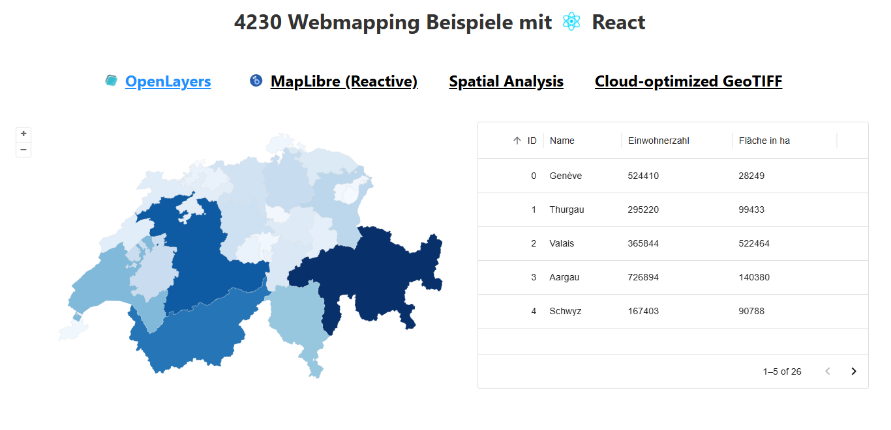

OpenClimbingMap

Das ist die Projekt Website von openClimbingMap. Die GDI enthält eine Server und eine Client Umgebung.

- Server: FastAPI
- Client: React + OpenLayers

GitHub Repository: [https://github.com/gianschneider/openClimbingMap](https://github.com/gianschneider/openClimbingMap)

