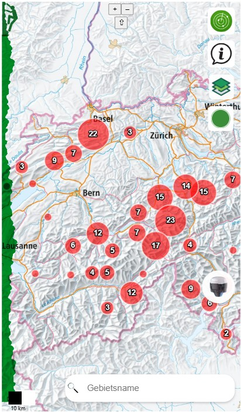

# GDI-Projekt - openClimbingMap

Willkommen bei der openClimbingMap App
Diese GitHub-Seite präsentiert die openClimbingMap – eine interaktive, open-source Plattform für Kletterbegeisterte. Hier findest du alle Informationen zur Funktionsweise, technischen Umsetzung und Weiterentwicklung der zugehörigen Smartphone-App.

Die openClimbingMap ermöglicht es, Klettergebiete einfach zu entdecken, neue Gebiete mit relevanten Informationen zu erfassen und sich mit anderen über Kletterorte auszutauschen. Ziel ist es, eine gemeinschaftlich gepflegte Geodatenbasis zu schaffen – inspiriert vom Konzept von OpenStreetMap.

### Was kann die App?

- **Klettergebiete finden:** Standortbasiert oder über gezielte Suche und Filterfunktion nach bestehenden Klettergebieten suchen.
- **Neue Gebiete erfassen:** Neue Kletterspots inklusive relevanter Informationen wie Schwierigkeitsgrad, Routenanzahl und Koordinaten hinzufügen und öffentlich zugänglich machen.
- **Wetterdaten anzeigen:** Aktuelle Wetterinformationen für das ausgewählte Klettergebiet abrufen.
- **Interaktive Karten nutzen:** Über ein benutzerfreundliches Layermenü verschiedene Hintergrundkarten auswählen und weitere Features visualisieren.

### Ansicht der Startseite

  

Dieses Projekt entstand im Rahmen des Vertiefungsmoduls 4230 „Geoinformatik & Raumanalyse I“ im Bachelorstudiengang Geomatik an der Fachhochschule Nordwestschweiz (FHNW). Das Thema konnte frei gewählt werden, musste jedoch eine räumlich-zeitliche Analyse beinhalten.

In den folgenden Abschnitten werden die Funktionen der App, die technische Architektur der Geodateninfrastruktur, das konzeptionelle Design sowie mögliche Erweiterungen detailliert vorgestellt.

#### Projektteam

- [Gian Schneider](https://github.com/gianschneider)
- [Pascal Kalbermatten](https://github.com/pasika23)
- [Youssef Shamoun](https://github.com/YoussefShamoun)

### Links

- [Download **ZIP File**](https://github.com/gianschneider/openClimbingMap/archive/refs/heads/main.zip)
- [Fork On **GitHub**](https://github.com/gianschneider/openClimbingMap)

[↑](#top)

  

  

  

    <a href="einleitung.html">Einleitung →</a>
  

