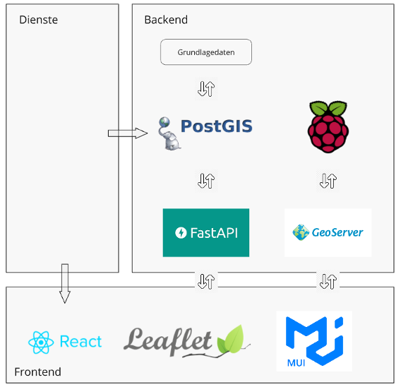
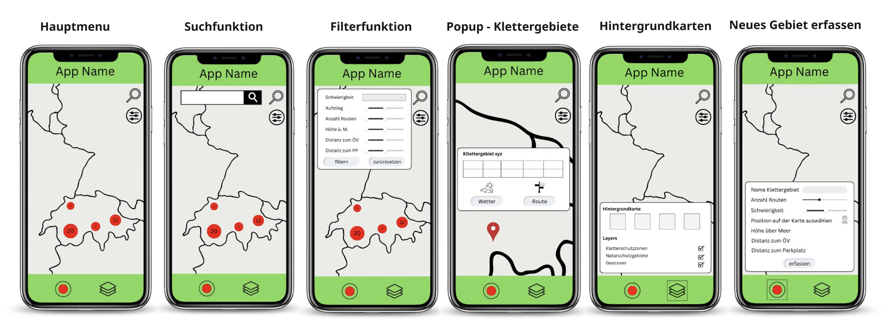

# Ursprüngliches Konzept

Dieser Abschnitt beschäftigt sich mit der konzeption und der Gestaltung von openClimbingMap. Diese Überlegungen wurden vor der Datenbeschaffung und der Entwicklung des Frontends diskutiert.

### Aufbau Geodateninfrastruktur (GDI)

Das folgende Schema visualisiert den Aufbau der Geodateninfrastruktur in der Konzeptionsphase. Während der Front- und Backendentwicklung wurde diese jedoch agil an die Umstände angepasst. Je nachdem gab es unerwartete Herausforderungen oder einfachere Möglichkeiten, um das Ziel zu erreichen. Die finale Architektur der GDI ist [hier](#gdi-final) sichtbar.

### Mockup

Zur technischen Umsetzung des Frontends wurde zuvor ein Mockup für das User-Interface designed. Die Anordnung und Darstellung der Buttons erhielt viel Aufmerksamkeit. Eine Smartphone-App wird nur genutzt, wenn sie intuitiv, einfach und schnell zu nutzen ist. Diese Überlegungen verhindern Mehraufwand während der Frontendentwicklung aufgrund von veränderten Designentscheidungen. Dennoch weicht das Frontend teils stark vom Mockup ab, weil während der Entwicklung festgestellt das nicht alles im Mockup optimal ist. Die nachfolgenden Abbildungen zeigen das Mockup.

**_Abweichungen bezüglich Endprodukt:_**

### Visualisierungsideen

[↑](#top)

  

    <a href="aufbauGDI.html">← Aufbau GDI</a>
  

  

    <a href="ausblick.html">Erweiterungsmöglichkeiten →</a>
  

