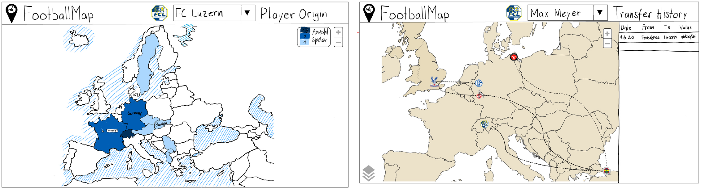

# Ursprüngliches Konzept

Dieser Abschnitt beschäftigt sich mit der konzeption und der Gestaltung von openClimbingMap. Diese Überlegungen wurden vor der Datenbeschaffung und der Entwicklung des Frontends diskutiert.

### Aufbau Geodateninfrastruktur (GDI)

Das folgende Schema visualisiert den Aufbau der Geodateninfrastruktur in der Konzeptionsphase. Während der Front- und Backendentwicklung wurde diese jedoch agil an die Umstände angepasst. Je nachdem gab es unerwartete Herausforderungen oder einfachere Möglichkeiten, um das Ziel zu erreichen. Die finale Architektur der GDI ist [hier](#gdi-final) sichtbar.

### Mockup

Für technischen Umsetzung des Frontends wurde zuvor ein Mockup für das User-Interface designed. Die Anordnung und Darstellung der Buttons erhielt viel Aufmerksamkeit. Eine Smartphone-App wird nur genutzt, wenn sie intuitiv und mehrwertbringend zu nutzen ist. wurde der Gestaltung der Visualisierungen gewidmet, um sicherzustellen, dass diese für die Anwender intuitiv, einfach und vor allem verständlich sind. Durch die vielen Überlegungen im Vorfeld konnten zahlreiche Fragen und Probleme bereits bei der Erstellung des Mockups geklärt werden, was die Entwicklung des Frontends erheblich vereinfachte. Zudem ist anzumerken, dass das Ergebnis nicht stark vom skizzierten Mockup abweicht. Die nachfolgenden Abbildungen zeigen das Mockup, wobei sich einige Features und Darstellungsmerkmale in der endgültigen Version noch unterscheiden können.

**_Abweichungen bezüglich Endprodukt:_**

### Visualisierungsideen

[↑](#top)

  

    <a href="aufbauGDI.html">← Aufbau GDI</a>
  

  

    <a href="ausblick.html">Erweiterungsmöglichkeiten →</a>
  

