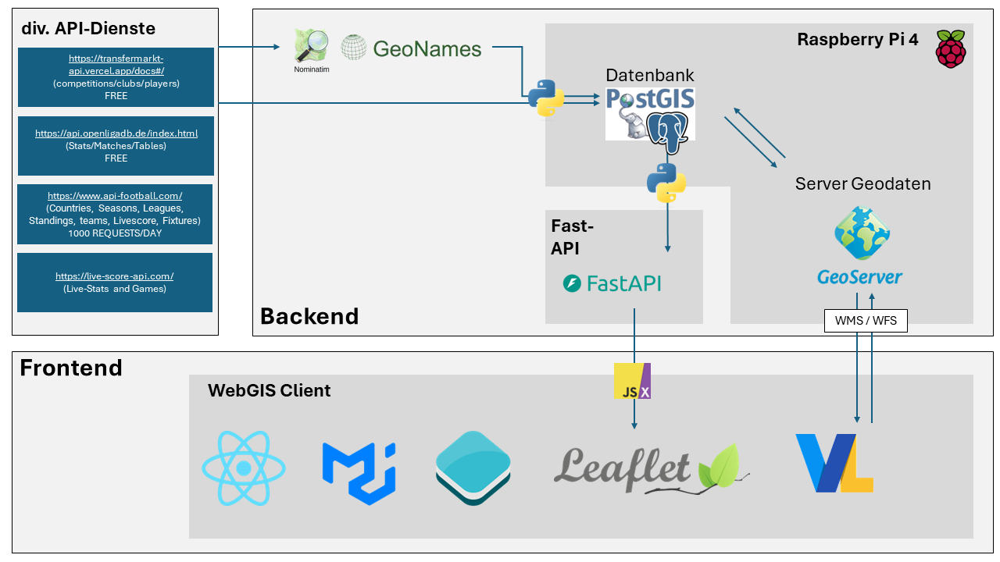
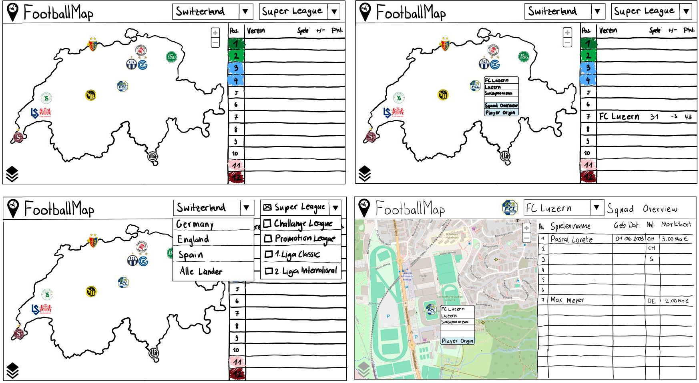

# Ursprüngliches Konzept

Diesees Kapitel behandelt die ersten Ideen des Aufbaus und der Gestaltung von openClimbingMap. Die Konzeption erfolgte vor der Datenbeschaffung und der Entwicklung des Frontend.

### Aufbau Geodateninfrastruktur (GDI)

Im folgenden Bild ist ein erster Entwurf der Architektur der GDI zu sehen. Während der Beschaffung der Daten und des Erstellens der Oberfläche entstanden Herausforderungen, die schlussendlich anders als geplant gelöst wurden. Auch konnten einige Prozesse einfacher als geplant gelöst werden. Die finale Architektur der GDI ist [hier](#gdi-final) sichtbar.

### Mockup

Bevor mit der technischen Umsetzung des Frontends begonnen wurde, wurde zunächst ein Konzept für das User-Interface skizziert. Besondere Aufmerksamkeit wurde der Gestaltung der Visualisierungen gewidmet, um sicherzustellen, dass diese für die Anwender intuitiv, einfach und vor allem verständlich sind. Durch die vielen Überlegungen im Vorfeld konnten zahlreiche Fragen und Probleme bereits bei der Erstellung des Mockups geklärt werden, was die Entwicklung des Frontends erheblich vereinfachte. Zudem ist anzumerken, dass das Ergebnis nicht stark vom skizzierten Mockup abweicht. Die nachfolgenden Abbildungen zeigen das Mockup, wobei sich einige Features und Darstellungsmerkmale in der endgültigen Version noch unterscheiden können.

**_Abweichungen bezüglich Endprodukt:_**

### Visualisierungsideen

[↑](#top)

  

    <a href="aufbauGDI.html">← Aufbau GDI</a>
  

  

    <a href="ausblick.html">Erweiterungsmöglichkeiten →</a>
  

